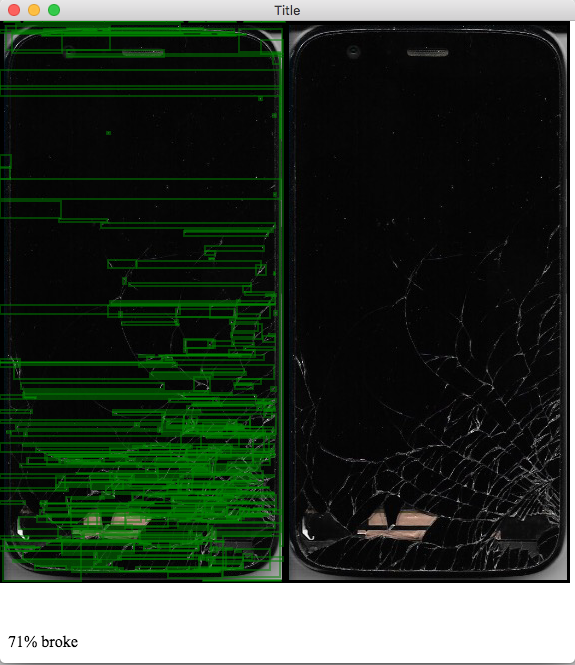

# Broken Screen Mapper for nodejs


This project aims to map the screen of the person's cell phone.
It is obvious that it can be used for other things.

## How it works

Through opencv I could recognize fractures only with a picture of the cell phone.
With Opencv I have delimited the area where the cell phone screen is, recognizing that it is black.
I made a mask of the canvas, and with this mask I took all the possible edges, in the image.
After that, it's simple to compare between the mascara and the edges, to get only the broken parts.

One must think that the broken screen of the cell phone is much more complicated than taking only the broken parts in the form of dots, so I made a rectangle in each dot grouping, after that I made a merge of the nearest rectangles.

Do not worry, I left a threshold for control of that.

## Specifications

|         function         | default |                                                                                                                                                               description                                                                                                                                                               |
|:----------------------:|:-------:|:-------------------------------------------------------------------------------------------------------------------------------------------------------------------------------------------------------------------------------------------------------------------------------------------------------------------------------------:|
| setThreshFindSquare    | 20      | This threshold serves to delimit or increase the number of recognized rectangles                                                                                                                                                                                                                                                      |
| getThreshFindSquare    | -       |  Returns the amount placed on the recognition threshold of the broken parts                                                                                                                                                                                                                                                           |
| setNThresholdLevel     | 10      | If the image is black and white, to another threshold to be placed.                                                                                                                                                                                                                                                                   |
| getNThresholdLevel     | -       | Return N Threshold Level                                                                                                                                                                                                                                                                                                              |
| setThreshOfMescleRetct | 100     | This threshold serves to increase or decrease the merge between the near rectangles                                                                                                                                                                                                                                                   |
| getThreshOfMescleRetct | -       | Return mescle threshold                                                                                                                                                                                                                                                                                                               |
| getSquare              | Object  | Returns an object containing the list of rectangles, along with the boundary placed.(The delimitation can be passed as a parameter for this method)                                                                                                                                                                                   |
| getPercentOfRetangles  | double  | Returns the percentage of the area occupied by all rectangles. Which in the background represent the broken parts of the screen. It is useful to know that the calculation of this method is based on the number of pixels in the image (area of the image) and the number of pixels in each rectangle (area added of each rectangle). |


## Description of each method

A brief documentation on each methods

#### setThreshFindSquare(int)

changes the default threshold to search for rectangles

```
const brock = require('broken-screen')
brock.setThreshFindSquare(20)

let retangles = brock.getSquare('imagePath');
```

#### int getThreshFindSquare()

returns the threshold amount

```
const brock = require('broken-screen')
int number = brock.getThreshFindSquare()

console.log(number)
```

#### setNThresholdLevel(int)

if the image is in black and white it makes a different calculation

```
const brock = require('broken-screen')
brock.setNThresholdLevel(10)

let retangles = brock.getSquare('imagePath');
```

#### int getNThresholdLevel

returns the threshold amount

```
const brock = require('broken-screen')
int number = brock.getNThresholdLevel()

console.log(number)
```

#### getSquare(string, [object, array], array)

return to an object, containing the dimension (object) and a list containing the rectangles (array).
Must be passed as the first parameter a string containing the location of the image

```
const brock = require('broken-screen')
int retangles = brock.getSquare('imagePath', {width: 1, x: 20, y:10, height: 30}, [{width: 1, x: 20, y:10, height: 30}]);

console.log(number)
```

#### double getPercentOfRetangles()

Returns a percentage based on the pixel amount of the image, and the area of the past rectangles. If no rectangle is passed, it will try to find them again in the image.

```
const brock = require('broken-screen')
int number = brock.getPercentOfRetangles('imagePath', [{width: 1, x: 20, y:10, height: 30}])

console.log(number)
```

## Result

